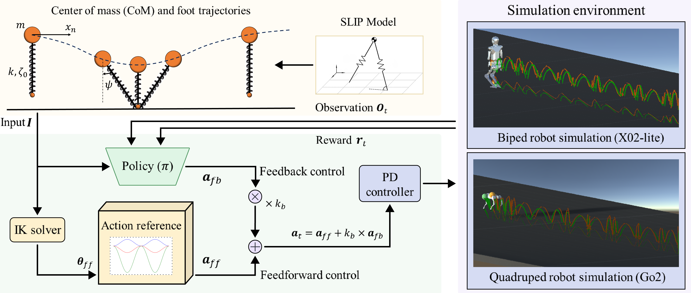

# SRL-Locomotion

# SRL: Combining SLIP Model and Reinforcement Learning for Agile Robotic Jumping

[](https://chatgpt.com/c/6a31ec1c-3744-83ee-b863-e654f198497c)
[](https://chatgpt.com/c/LICENSE)
[](https://chatgpt.com/c/6a31ec1c-3744-83ee-b863-e654f198497c)

Official code release accompanying the paper:

**SRL: Combining SLIP Model and Reinforcement Learning for Agile Robotic Jumping**

<p align="center">
  
</p>
<p align="center">
  <em>
  Overview of the SRL control framework for robot jumping tasks, integrating the SLIP model, RL, and simulation environment. SRL combines the physically grounded motion dynamics of the SLIP model with the adaptability of RL to optimize jumping performance in complex environments such as flat ground with varying disturbances, stairs, and boxes.
  </em>
</p>


------

# 📑 Table of Contents

- Overview
- Highlights
- Repository Structure
- Unity Simulation Environment
- Gym Installation and Usage
- Sim-to-Sim Deployment
- Demonstration Videos
- Notes
- Citation
- License
- Acknowledgements

------

# 📖 Overview

SRL is a physics-guided reinforcement learning framework designed for agile robotic jumping.

Unlike purely model-based or purely learning-based methods, SRL combines:

- SLIP-based feedforward motion generation
- RL-based feedback control
- Adaptive feedforward-feedback action fusion
- Curriculum learning
- Sim-to-sim transfer

to achieve robust and efficient jumping performance.

The framework has been validated on both:

- Unitree Go2 quadruped robot
- X02-lite biped robot

across multiple jumping tasks and terrain conditions.

------

# ✨ Highlights

- A hybrid SRL framework integrating SLIP model and reinforcement learning for legged robot jumping.
- Six-phase motion modulation for enhanced jumping stability and dynamics.
- Higher success rate and training efficiency than SLIP-based MPC and RL-only methods.
- Verified by simulation and real-world experiments with accurate trajectory tracking.

------

# 📂 Repository Structure

```text
SRL-Locomotion
│
├── unity/
│   ├── prefabs/
│   ├── urdf/
│   ├── Go2Agent.cs
│   ├── Go2Step.cs
│   ├── X02Agent.cs
│   └── configuration.yaml
│
├── isaacgym/
│   ├── envs/
│   ├── configs/
│   └── scripts/
│
├── mujoco/
│   └── sim2sim_mujoco.py
│
├── media/
│   ├── frame.png
│   ├── Go2_F.mp4
│   ├── Go2_R.mp4
│   ├── Go2_Step.mp4
│   ├── SRL.mp4
│   ├── X02_F.mp4
│   └── X02_R.mp4
│
└── README.md
```

------

# 🎮 Unity Simulation Environment

The repository includes a Unity-based environment used for robot simulation, visualization, and policy deployment.

The Unity project contains robot assets, URDF models, prefabs, controller implementations, and configuration files for the supported platforms, including the Unitree Go2 quadruped robot and the X02-lite biped robot.

Key components include:

- `Go2Agent.cs` – Go2 jumping controller
- `Go2Box.cs` – Go2 box-jumping controller
- `X02Agent.cs` – X02 jumping controller
- `configuration.yaml` – controller configuration

For Unity environment setup and deployment workflow, users may refer to the Unity-RL-Playground project:

https://github.com/loongOpen/Unity-RL-Playground

The provided Unity assets serve as a visualization and deployment platform for evaluating the locomotion and jumping behaviors generated by the proposed SRL framework.

# 🛠 Gym Installation and Usage

The SRL training framework is built upon the open-source Humanoid-Gym ecosystem. Users should first install the required dependencies by following the official Humanoid-Gym setup instructions:

https://github.com/roboterax/humanoid-gym

After completing the installation, the SRL modules provided in this repository can be integrated into the corresponding training framework. The released code includes the core components of the proposed method, including SLIP-guided motion generation, adaptive feedforward-feedback action fusion, curriculum learning strategies, task-specific jumping environments, and sim-to-sim deployment scripts. These modules constitute the main algorithmic contributions reported in the paper.

For complete training infrastructure and PPO implementation details, users are encouraged to build upon the original Humanoid-Gym and RSL-RL frameworks while incorporating the released SRL components.

------

# 🔄 Sim-to-Sim Deployment

To further evaluate the generalization capability of the proposed SRL framework, we provide the MuJoCo deployment script used in the sim-to-sim experiments reported in the paper.

The script transfers policies trained in Isaac Gym to MuJoCo for validation under an independent physics engine.

```bash
python mujoco/sim2sim_mujoco.py
```

------

# 🎥 Demonstration Videos

## Quadruped (Go2)

- Go2_F.mp4 — Fixed-distance jumping
- Go2_R.mp4 — Random-distance jumping
- Go2_B.mp4 — Box-jumping

## Biped (X02-lite)

- X02_F.mp4 — Fixed-distance jumping
- X02_R.mp4 — Random-distance jumping

## Framework Overview

- SRL.mp4 — Overview and experimental demonstrations

------

# 📝 Notes

This repository releases the core implementation and representative experimental assets used in the paper.

The repository is intended as a reference implementation.

Some platform-specific infrastructure is not included:

- Hardware deployment interfaces
- Robot communication middleware
- Internal training infrastructure
- Pretrained models
- Third-party proprietary assets

For complete implementation details, please refer to the accompanying paper.

------

# 📄 Citation

If you find this work useful in your research, please cite:

```bibtex
@article{hu2026srl,
  title={SRL: Combining SLIP Model and Reinforcement Learning for Agile Robotic Jumping},
  author={Hu, Xiaowen and Ye, Linqi and others},
  journal={Robotics and Autonomous Systems},
  year={2026}
}
```

------

# 📜 License

This project is released under the MIT License.

See LICENSE for details.

------

# 🙏 Acknowledgements

This work was conducted at Shanghai University.

The implementation builds upon several excellent open-source projects, including:

- Humanoid-gym
- RSL-RL
- MuJoCo
- Unity Robotics

We sincerely thank the open-source robotics community for making legged locomotion research more accessible and reproducible.
